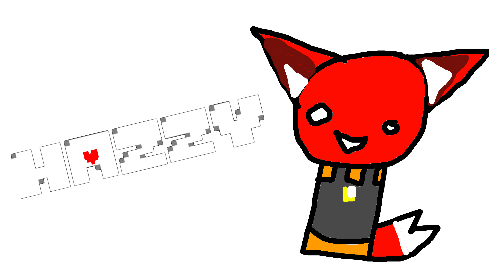

# Hazzy

One day..

You were helping the research of "Raytraxians" by collecting samples of the creatures's DNA

And then before you know it you are being chased by one and before you know, they scratch you and you feel your body

start to transform. You feel fur on yourself. You gain paws instead of hand before you know it. It feels like

Wearing a fursuit that you can't take off. The creature taking over your body feels proud of this catch and they

prepair to use your body as it's puppet. But the next thing you know

**YOU**

the player take control instead and now you must be them. You can choose to fight others or spare them

The choise is up to you my friend. Each action has a consequence, postive or negitave. **You** get to make that choice.

Will **you** make your creatue live a happy life with all of it's friends. Or make it a living hell...

## About

Hazzy is a fan game for the ROBLOX game [Kaiju Paradise](https://www.roblox.com/games/6456351776/) and the game [Undertale](https://undertale.com/).

It's about you getting to play a fox/cat hybrid creatue named hazzy. You control them and make them do stuff and what you do result in differnt endings.

This is a emotional game too bringing light to sentive topics like depression and suicide.

This is a personal project I made. This was just to anwser the question "What if the rays and humans live together peacefully"

And this is it!

I want to keep this project in my vison of both the idea of "rays and humans living peacefully" and how mental health effect you and others.

The game uses undertale's battle system plus some other stuff from undertale (and deltarune) but it has a orginal story written by me

I just want to bring my fan fics and head cannons to life with this lolz

# Project's codebase

The project is open source!

Most of this project code is written in Lua using a framework called [LÖVE2D](https://www.love2d.org/). It's a *awsome* framework and it helps make the game run how it is

The game uses a bunch of libraries but you can find them in the git sub modules but i will also leave a list of them in the credits!

If you wanna make your own version of hazzy or mod it. Then please do! I love when people do that and i wanna see more ray-human dymanics in the KP fandom

so if you wanna make a mod or a fork. Please do, I would love for you to that and it would mean the world if you made your own really cool story like this.

Please fork.

I left good code comments on how everything works and i made some documeantions on how to use the `hazzy_core` libray and the others used.

## getting started.

Read the docs [here](https://drwhomust.gitbook.io/hazzy/)

but if wanna raw dog it then get the source code by running

`
git clone --recurse-submodule https://github.com/Drwhomust/hazzy.git
`

Open up VS code and get started. But please, at least read the code comments and the docs!!

# Credits

## main

- Game was created by me! [Drwhomust](https://www.drwhomust.xyz/)

- Personal experience used for the topics around depression and suicide

- Current maintainer for the game

## Music and other assets

Most of them were made by [Toby Fox](https://bsky.app/profile/tobyfox.undertale.com) and were from undertale

## Insperation

I was inspired by these games when making hazzy

### Main

- [Undertale](https://undertale.com/)
- [Deltarune](https://deltarune.com/)
- [Kaiju Paradise](https://www.roblox.com/games/6456351776/)

### Art style

I like to combind differnt art styles to make the game feel more werid. (Like a game a werid kid in class would play)

Here are the differnt styles i used and others i took inspreation from:

- My main art style (a combination of the [2000s emo/scene art style](https://duckduckgo.com/?t=ffab&q=2000s%20emo%20scene%20art%20style&ia=images&iax=images) and the pizza tower art style)
- [ENA](https://youtube.com/playlist?list=PLhPaJURyApsoMQDaoft5t0l0iAwUOLtlM&si=-1VOtSY2kdJyq6Yf)
- Warioware style ([best example i could find](https://www.newgrounds.com/art/view/m-kirbs/more-characters-in-the-warioware-get-it-together-style))

### For the pacifist ending

I took inspration from undertale for the pacifist ending. (undertale's pacifist ending)

### genocide/bad ending

I took **A LOT** inspation from [OMORI](https://www.omori-game.com/)'s bad ending and also a little from [Adventures with Anxienty](https://ncase.me/anxiety/)

I also used some personal experience with these topics too for this ending

## Tools used

- made using [love](https://www.love2d.org/) :3
- used [hump](https://github.com/HDictus/hump/tree/temp-master), [lovesize](https://github.com/RicardoBusta/lovesize), [StackingSceneMgr](https://gitlab.com/V3X3D/love-libs/-/tree/master/StackingSceneMgr), and [windfield](https://github.com/a327ex/windfield)
- ported to web using [love.js](https://github.com/2dengine/love.js)
- vscode
- flatpak to port

## special thanks

- [Laminax](https://www.roblox.com/communities/6423736/LAMINAX-CO#!/about) and [toby fox](https://bsky.app/profile/tobyfox.undertale.com) for making peak games! and thanks for shaping me to who i am today.

My friends who play tested (their discords)

- thecraigplague
- st3rsareawsome_44969
- namesjeffthegoo
- projext__
- bart097_66685
- bluex1507_notion

# final note

uhhh thanks for reading and enjoy the game :3
